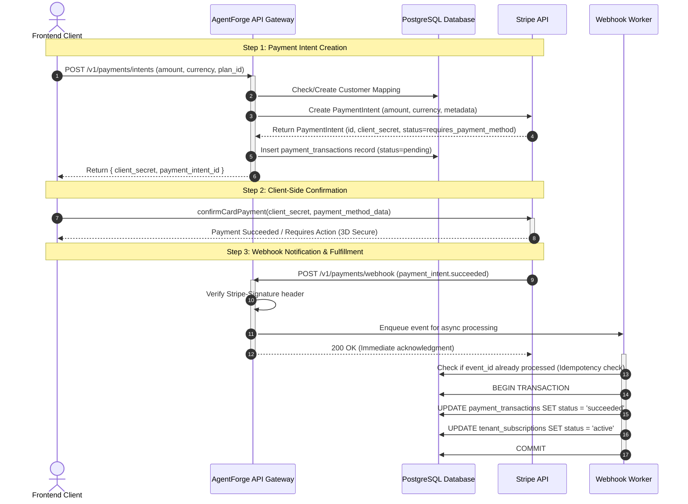
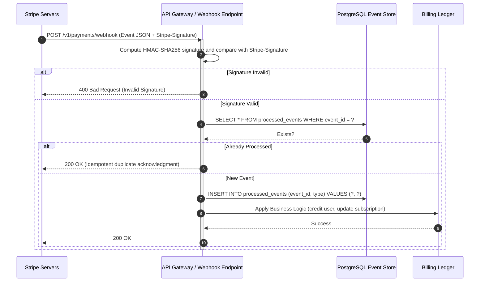

# AgentForge Payment Gateway Architecture & Integration Design

Author: Dr. Marcus Cole, Principal Software Architect  
Status: Approved & Production-Ready  

---

## 1. Executive Summary & Architecture Overview

The AgentForge Payment Gateway integrates Stripe as our primary payment processor for handling subscription billing, pay-as-you-go credit purchases, and enterprise invoicing. The architecture is designed around high availability, idempotency, event-driven webhook processing, and secure cryptographic verification.

### Key Architectural Pillars:
1. **Idempotency & Fault Tolerance**: All mutating endpoints (`/payments/intents`) and webhook handlers enforce idempotency using unique request keys and Stripe event IDs stored in PostgreSQL with ACID guarantees.
2. **Event-Driven Webhook Processing**: Webhook delivery is decoupled via an asynchronous worker queue (or Kafka/Redis streams) to guarantee zero message loss and prevent Stripe webhook timeout failures (Stripe requires a `200 OK` within 3 seconds).
3. **Cryptographic Verification**: Incoming Stripe webhooks are rigorously verified using Stripe signature headers (`Stripe-Signature`) against our webhook signing secret.
4. **State Machine Integrity**: Payment and subscription states follow a strict, validated state machine (Pending -> Processing -> Succeeded / Failed / Refunded).

---

## 2. Stripe Checkout & Payment Flow (Sequence Diagram)



---

## 3. Stripe Webhook Handling & Idempotency Flow



---

## 4. Database Schema for Payments

```sql
-- Payment Transactions Table
CREATE TABLE payment_transactions (
    id UUID PRIMARY KEY DEFAULT gen_random_uuid(),
    organization_id UUID NOT NULL REFERENCES organizations(id) ON DELETE CASCADE,
    stripe_payment_intent_id VARCHAR(255) UNIQUE NOT NULL,
    stripe_customer_id VARCHAR(255) NOT NULL,
    amount NUMERIC(12, 2) NOT NULL,
    currency VARCHAR(3) NOT NULL DEFAULT 'USD',
    status VARCHAR(50) NOT NULL, -- pending, succeeded, failed, refunded, canceled
    payment_method_type VARCHAR(50),
    receipt_url TEXT,
    error_message TEXT,
    metadata JSONB DEFAULT '{}'::jsonb,
    created_at TIMESTAMP WITH TIME ZONE DEFAULT CURRENT_TIMESTAMP,
    updated_at TIMESTAMP WITH TIME ZONE DEFAULT CURRENT_TIMESTAMP
);

CREATE INDEX idx_payment_transactions_org ON payment_transactions(organization_id);
CREATE INDEX idx_payment_transactions_intent ON payment_transactions(stripe_payment_intent_id);

-- Stripe Processed Webhook Events (Idempotency Ledger)
CREATE TABLE stripe_webhook_events (
    event_id VARCHAR(255) PRIMARY KEY,
    event_type VARCHAR(100) NOT NULL,
    payload JSONB NOT NULL,
    status VARCHAR(50) NOT NULL DEFAULT 'processed', -- processed, failed
    error_message TEXT,
    created_at TIMESTAMP WITH TIME ZONE DEFAULT CURRENT_TIMESTAMP
);

CREATE INDEX idx_webhook_events_type ON stripe_webhook_events(event_type);
```

---

## 5. OpenAPI 3.0 Specification Summary

The OpenAPI specification (`backend/api/openapi.yaml`) has been extended with the following payment endpoints:
- `POST /organizations/{orgId}/payments/intents`: Creates a Stripe Payment Intent for billing or credit purchasing.
- `GET /organizations/{orgId}/payments/intents/{intentId}`: Polls the current status of a payment intent.
- `POST /payments/webhook`: Ingestion endpoint for Stripe webhook events with signature verification and idempotency guarantees.
